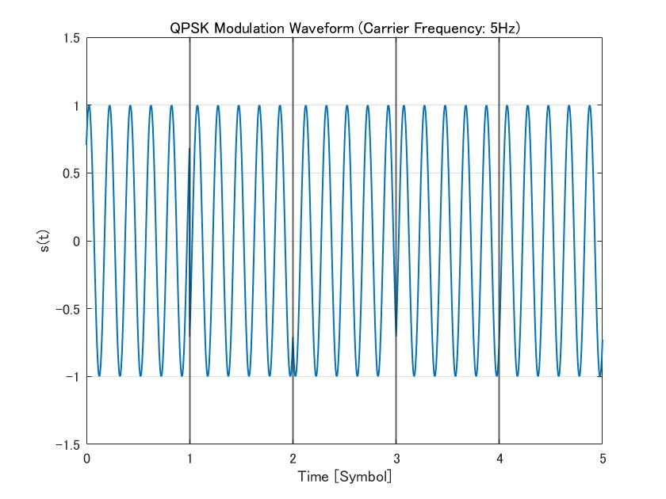
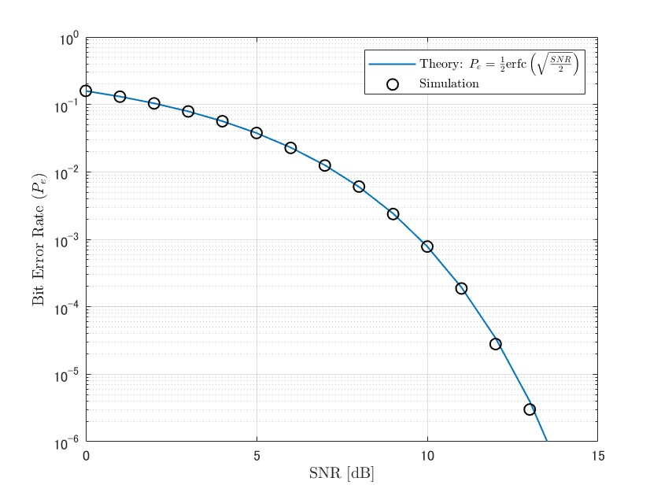
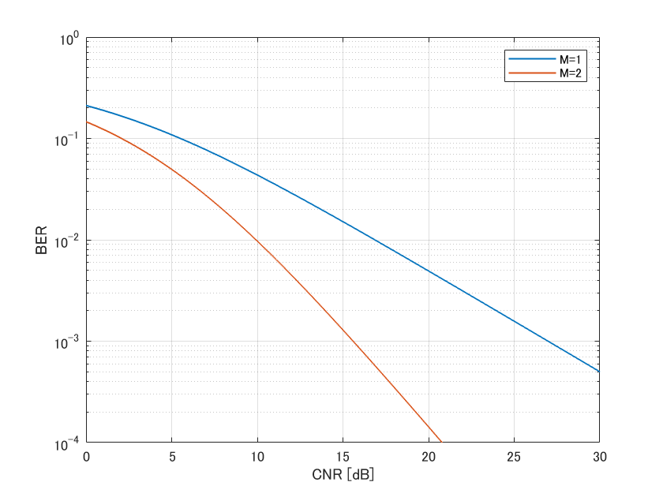

# 通信理論

通信理論の演習課題で用いたコードやレポートをまとめたリポジトリ。プログラムはすべてMATALABで書かれている。

## 出力結果とレポート
### 第9回：QPSK変調シミュレーション
[第9回レポート](./ex9/第9回通信理論_演習課題_1W242038_植木敬太郎.pdf)

### 第11回：BPSK変調およびBox-Muller法による正規分布雑音生成
[第11回レポート](./ex11/第11回通信理論_演習課題_1W242038_植木敬太郎.pdf)

### 第14回：ダイバーシチ技術の適用効果の検証
[第14回レポート](./ex14/第14回通信理論_演習課題_1W242038_植木敬太郎.pdf)
